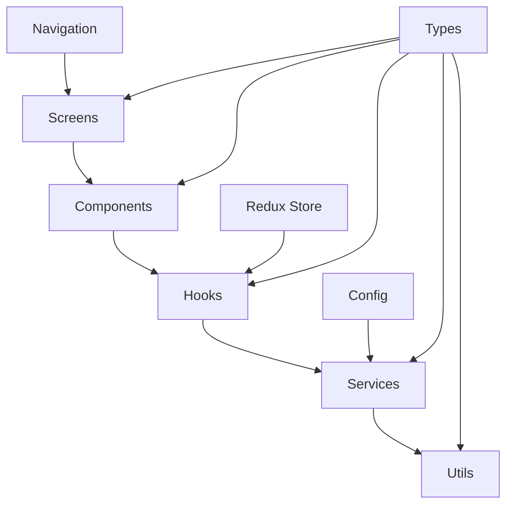

This document provides a comprehensive overview of how the Solana App Kit codebase is organized. Understanding this structure will help you navigate the project efficiently and know exactly where to make changes for your specific needs.

## Root Directory Overview

```
solana-app-kit/
├── src/                    # Mobile app source code
├── server/                 # Backend server
├── android/                # Android-specific files
├── ios/                    # iOS-specific files
├── docs/                   # Documentation
├── scripts/                # Build and utility scripts
├── App.tsx                 # Main app component
├── package.json            # Dependencies and scripts
└── Configuration files     # Various config files
```

<Note>
  **Monorepo Structure**: The kit combines mobile app, backend server, and documentation in a single repository for easier development and maintenance
</Note>

## Mobile App Structure (`src/`)

The mobile application is organized into several key directories, each serving a specific purpose:

<Tabs>
  <Tab title="Core Features">
    **`src/core/`** - Essential app functionality used across multiple screens
    
    ```
    src/core/
    ├── chat/                   # AI chat integration
    ├── dev-mode/              # Development tools and debugging
    ├── profile/               # User profile management
    ├── shared-ui/             # Reusable UI components
    └── thread/                # Social feed and threading
    ```
    
    <CardGroup cols={2}>
      <Card title="Chat" icon="message" href="/docs/modules/solana-agent-kit">
        **AI chat integration** with Solana blockchain interactions
      </Card>
      <Card title="Dev Mode" icon="bug">
        **Development tools** for debugging and testing
      </Card>
      <Card title="Profile" icon="user">
        **User profile management** and account settings
      </Card>
      <Card title="Shared UI" icon="palette">
        **Reusable components** used throughout the application
      </Card>
      <Card title="Thread" icon="comments" href="/docs/functions/thread">
        **Social feed and threading** for community features
      </Card>
    </CardGroup>
    
    **Purpose**: Core features are central to the app's functionality and provide shared capabilities across multiple screens and modules.
  </Tab>
  
  <Tab title="Modules">
    **`src/modules/`** - Independent, protocol-specific integrations
    
    ```
    src/modules/
    ├── data-module/           # Blockchain data fetching
    ├── meteora/               # Meteora protocol integration
    ├── moonpay/               # MoonPay fiat on-ramp
    ├── nft/                   # NFT functionality
    ├── pump-fun/              # Pump.fun integration
    ├── raydium/               # Raydium DEX integration
    ├── solana-agent-kit/      # AI agent integration
    ├── swap/                  # Token swapping
    ├── token-mill/            # Token creation and management
    └── wallet-providers/      # Wallet connection providers
    ```
    
    <CardGroup cols={2}>
      <Card title="Data Module" icon="database" href="/docs/modules/data-module">
        **Blockchain data fetching** and market information
      </Card>
      <Card title="Meteora" icon="meteor" href="/docs/modules/meteora">
        **Dynamic Liquidity Markets** integration
      </Card>
      <Card title="MoonPay" icon="credit-card" href="/docs/modules/moonpay">
        **Fiat on-ramp** for purchasing crypto
      </Card>
      <Card title="NFT" icon="image" href="/docs/modules/nft">
        **NFT functionality** with Tensor integration
      </Card>
      <Card title="Pump.fun" icon="rocket" href="/docs/modules/pump-fun">
        **Meme token creation** and trading
      </Card>
      <Card title="Raydium" icon="waves" href="/docs/modules/raydium">
        **Professional token launching** platform
      </Card>
      <Card title="Solana Agent Kit" icon="robot" href="/docs/modules/solana-agent-kit">
        **AI agent integration** for automated interactions
      </Card>
      <Card title="Swap" icon="arrow-right-arrow-left" href="/docs/modules/swap">
        **Multi-DEX token swapping** with optimal routing
      </Card>
      <Card title="Token Mill" icon="gear" href="/docs/modules/token-mill">
        **Advanced token creation** with custom bonding curves
      </Card>
      <Card title="Wallet Providers" icon="wallet" href="/docs/modules/wallet-providers">
        **Multi-provider wallet** connection and management
      </Card>
    </CardGroup>
    
    **Purpose**: Each module encapsulates a specific protocol or feature, making the codebase modular, maintainable, and allowing you to use only what you need.
  </Tab>
  
  <Tab title="Screens">
    **`src/screens/`** - React Native screens organized by feature area
    
    ```
    src/screens/
    ├── Common/                # Shared screens
    │   ├── intro-screen/      # App introduction
    │   ├── login-screen/      # Authentication
    │   └── launch-modules-screen/ # Feature selection
    └── sample-ui/             # Example implementations
        ├── chat/              # Chat interface examples
        └── Threads/           # Social feed examples
    ```
    
    <CardGroup cols={1}>
      <Card title="Common Screens" icon="share">
        **Shared across features** - intro, login, and module selection screens
      </Card>
      <Card title="Sample UI" icon="eye">
        **Example implementations** showing how to use core features and modules
      </Card>
    </CardGroup>
    
    **Purpose**: Screens define the user interface and navigation flow, providing the main entry points for different app features.
  </Tab>
  
  <Tab title="Shared Resources">
    **`src/shared/`** - Common utilities and configurations
    
    ```
    src/shared/
    ├── config/                # App configuration
    ├── context/               # React Context providers
    ├── hooks/                 # Custom React hooks
    ├── mocks/                 # Mock data for development
    ├── navigation/            # Navigation configuration
    ├── services/              # API and blockchain services
    ├── state/                 # Redux store and state management
    ├── types/                 # TypeScript type definitions
    └── utils/                 # Utility functions
    ```
    
    <CardGroup cols={2}>
      <Card title="Configuration" icon="gear">
        **App settings** and environment configuration
      </Card>
      <Card title="Context" icon="sitemap">
        **React Context** providers for global state
      </Card>
      <Card title="Hooks" icon="hook">
        **Custom React hooks** for reusable logic
      </Card>
      <Card title="Navigation" icon="route">
        **Navigation setup** and routing configuration
      </Card>
      <Card title="State Management" icon="database">
        **Redux store** and state management slices
      </Card>
      <Card title="Types" icon="code">
        **TypeScript definitions** for type safety
      </Card>
    </CardGroup>
    
    **Purpose**: Shared resources provide common functionality and maintain consistency across the entire application.
  </Tab>
  
  <Tab title="Assets">
    **`src/assets/`** - Static resources and design system
    
    ```
    src/assets/
    ├── images/                # Image files
    ├── svgs/                  # SVG graphics
    ├── colors.ts              # Color palette
    └── typography.ts          # Typography system
    ```
    
    <CardGroup cols={2}>
      <Card title="Images" icon="image">
        **Static image files** for app branding and UI
      </Card>
      <Card title="SVGs" icon="vector-square">
        **Scalable vector graphics** for icons and illustrations
      </Card>
      <Card title="Colors" icon="palette">
        **Color palette** definitions for consistent theming
      </Card>
      <Card title="Typography" icon="font">
        **Typography system** for consistent text styling
      </Card>
    </CardGroup>
    
    **Purpose**: Centralized asset management and design system definitions ensure visual consistency.
  </Tab>
</Tabs>

## Backend Server Structure (`server/`)

The backend server provides essential API endpoints and services:

<Accordion>
  <AccordionItem title="🗄️ Server Directory Structure">
    ```
    server/
    ├── src/
    │   ├── controllers/       # Request handlers
    │   ├── routes/            # API endpoint definitions
    │   ├── service/           # Business logic
    │   ├── db/                # Database configuration
    │   ├── types/             # TypeScript interfaces
    │   └── utils/             # Server utilities
    ├── package.json           # Server dependencies
    └── .env.example           # Environment template
    ```
    
    **Purpose**: The server handles blockchain operations, data persistence, external API integrations, and provides enhanced functionality for the mobile app.
  </AccordionItem>
</Accordion>

## Platform-Specific Directories

<Tabs>
  <Tab title="iOS Directory">
    **`ios/`** - iOS-specific configuration and native code
    
    ```
    ios/
    ├── SolanaAppKit/          # Main iOS project
    │   ├── Info.plist         # iOS app configuration
    │   ├── AppDelegate.mm     # iOS app delegate
    │   └── Images.xcassets/   # iOS app icons and images
    ├── Podfile                # CocoaPods dependencies
    └── SolanaAppKit.xcworkspace # Xcode workspace
    ```
    
    <Note>
      **iOS Development**: Requires macOS and Xcode for building and testing on iOS devices
    </Note>
  </Tab>
  
  <Tab title="Android Directory">
    **`android/`** - Android-specific configuration and native code
    
    ```
    android/
    ├── app/
    │   ├── src/main/          # Main Android source
    │   ├── build.gradle       # App-level build configuration
    │   └── proguard-rules.pro # Code obfuscation rules
    ├── gradle/                # Gradle wrapper
    └── build.gradle           # Project-level build configuration
    ```
    
    <Note>
      **Android Development**: Works on any platform with Android Studio and Java/Kotlin support
    </Note>
  </Tab>
</Tabs>

## Configuration Files

Key configuration files in the root directory:

<CardGroup cols={2}>
  <Card title="App.tsx" icon="react">
    **Main React Native component** and app initialization entry point
  </Card>
  <Card title="package.json" icon="package">
    **Project dependencies**, scripts, and metadata configuration
  </Card>
  <Card title="app.config.js" icon="gear">
    **Expo configuration** for builds, deployment, and app settings
  </Card>
  <Card title="babel.config.js" icon="code">
    **JavaScript compilation** configuration and plugin setup
  </Card>
  <Card title="metro.config.js" icon="subway">
    **Metro bundler** configuration for React Native builds
  </Card>
  <Card title="tsconfig.json" icon="typescript">
    **TypeScript compiler** configuration and type checking rules
  </Card>
  <Card title=".env.local" icon="key">
    **Environment variables** (not in repo, created during setup)
  </Card>
  <Card title="mint.json" icon="book">
    **Documentation configuration** for this documentation site
  </Card>
</CardGroup>

## Module Architecture Pattern

Each module follows a consistent, well-defined structure:

<CodeGroup>
```text Module Structure
module-name/
├── components/            # UI components specific to this module
├── hooks/                 # Custom hooks for module functionality
├── screens/               # Screens specific to this module
├── services/              # API and blockchain services
├── types/                 # TypeScript interfaces
├── utils/                 # Utility functions
├── index.ts               # Public API exports
└── README.md              # Module documentation
```

```typescript Example Module Export
// modules/example-module/index.ts
export { ExampleComponent } from './components/ExampleComponent';
export { useExample } from './hooks/useExample';
export { ExampleScreen } from './screens/ExampleScreen';
export { exampleService } from './services/exampleService';
export type { ExampleType } from './types';
```
</CodeGroup>

This pattern ensures:

<CardGroup cols={2}>
  <Card title="Consistency" icon="check-circle">
    **Similar organization** across all modules makes navigation predictable
  </Card>
  <Card title="Encapsulation" icon="box">
    **Module internals** are contained with clean public interfaces
  </Card>
  <Card title="Reusability" icon="recycle">
    **Clean public APIs** make modules easy to integrate and reuse
  </Card>
  <Card title="Maintainability" icon="wrench">
    **Easy to understand** and modify with clear separation of concerns
  </Card>
</CardGroup>

## Data Flow Architecture

Understanding how components connect and data flows through the application:

<Steps>
  <Step title="Component Hierarchy">
    **Screens** import and use **Components** from modules for UI composition
  </Step>
  
  <Step title="State Management">
    **Components** use **Hooks** for state management and business logic
  </Step>
  
  <Step title="External Operations">
    **Hooks** call **Services** for API interactions and blockchain operations
  </Step>
  
  <Step title="Utility Functions">
    **Services** use **Utils** for common operations and data processing
  </Step>
  
  <Step title="Type Safety">
    **Everything** uses **Types** for TypeScript type safety and IntelliSense
  </Step>
</Steps>

### Data Flow Diagram



## Development Workflow

Understanding the structure helps with common development tasks:

<ResponseField name="development_workflow" type="object">
<Expandable title="🔧 Adding New Features">
    1. **Create or extend modules** in `src/modules/` for protocol integrations
    2. **Add components** within the relevant module's `components/` directory
    3. **Create hooks** for business logic in the module's `hooks/` directory
    4. **Update module exports** in `index.ts` to expose new functionality
</Expandable>
  
<Expandable title="🎨 UI Changes">
    1. **Modify components** within relevant modules for feature-specific UI
    2. **Update shared components** in `src/core/shared-ui/` for common elements
    3. **Adjust styles** using the design system in `src/assets/`
    4. **Test across platforms** to ensure consistent appearance
</Expandable>
  
<Expandable title="📱 New Screens">
    1. **Add screens** to `src/screens/` organized by feature area
    2. **Update navigation** configuration in `src/shared/navigation/`
    3. **Add routing** for deep linking and navigation flows
    4. **Test navigation** on both iOS and Android platforms
</Expandable>
  
<Expandable title="🔌 API Integration">
    1. **Extend services** in modules for protocol-specific integrations
    2. **Add shared services** in `src/shared/services/` for common APIs
    3. **Update types** to include new API response interfaces
    4. **Add error handling** and status management
</Expandable>
  
<Expandable title="🏪 State Changes">
    1. **Update Redux slices** in `src/shared/state/` for global state
    2. **Add module-specific state** using local hooks when appropriate
    3. **Implement persistence** for important user data
    4. **Test state synchronization** across components
</Expandable>
</ResponseField>

## Best Practices

<CardGroup cols={2}>
  <Card title="Module Independence" icon="unlink">
    **Keep modules loosely coupled** to maintain modularity and testability
  </Card>
  
  <Card title="Shared Code" icon="share-nodes">
    **Put common functionality** in `src/shared/` for reusability across modules
  </Card>
  
  <Card title="Type Safety" icon="shield">
    **Define interfaces** in module `types/` directories for better developer experience
  </Card>
  
  <Card title="Export Consistency" icon="arrow-up-right-from-square">
    **Use `index.ts` files** for clean public APIs and easier imports
  </Card>
  
  <Card title="Documentation" icon="book">
    **Update module READMEs** when making changes to keep docs current
  </Card>
  
  <Card title="Testing" icon="vial">
    **Write tests** for critical business logic in services and hooks
  </Card>
</CardGroup>

## Next Steps

Now that you understand the repository structure, explore these guides:

<CardGroup cols={2}>
  <Card title="Assets Guide" icon="palette" href="/docs/structure/assets">
    **Learn about the design system** and asset management for consistent UI
  </Card>
  
  <Card title="Components Guide" icon="cubes" href="/docs/structure/components">
    **Understand component architecture** and reusable UI patterns
  </Card>
  
  <Card title="Configuration Guide" icon="gear" href="/docs/structure/config">
    **Configure the app** and understand environment settings
  </Card>
</CardGroup>